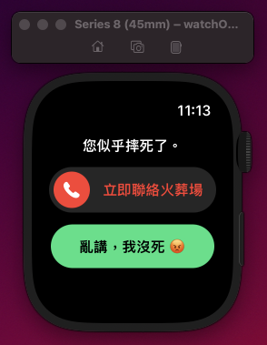

# Did you just fall?
## Introduction
Just a fun WatchOS side project without any practical use. It's won't really call the emergency service or your family members.

It provides two languages, English and Mandarin. The language will be changed according to the language setting of your iPhone. The app will be terminated after you press the button. It's a good practice for me to learn how to use the `WKInterfaceTimer` and `WKInterfacePicker` in WatchOS.

<table border="0">
    <tr>
        <td width="33%" style="text-align:center;font-size:14px;"><b>Simulator<b></td>
        <td width="33%" style="text-align:center;font-size:14px;"><b>English Version<b></td>
        <td width="33%" style="text-align:center;font-size:14px;"><b>Mandarin Version<b></td>
    </tr>
    <tr>
        <td></img></td>
        <td></img></td>
        <td></img></td>
    </tr>
</table>

## Environment
- macOS Ventura 13.3
- Xcode 14.3
- WatchOS 9.4

## Reference
- The source of the slider: [SlideButton](https://github.com/no-comment/SlideButton)